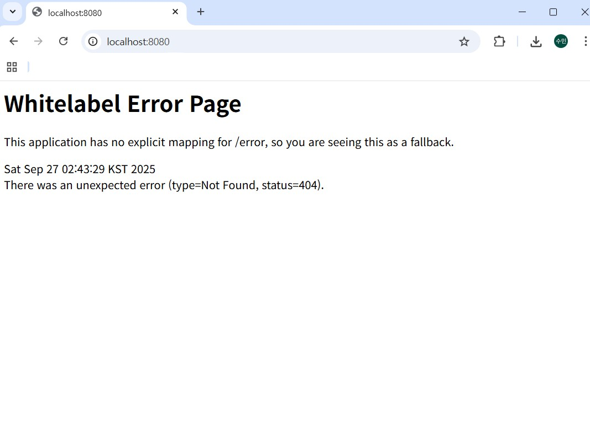

# 1. 웹이란?
웹과 인터넷은 다른개념  
인터넷: 여러 네트워크를 하나로 연결 -> 인터네트워크  
네트워크들의 네트워크, 전세계 컴퓨터와 기기들을 하나로 연결하는 거대한 글로벌 네트워크  
웹 : 이러한 인터넷 위에서 동작하는 다양한 서비스중 하나, 인터넷에 연결된 전세계컴퓨터들이 서로의 정보를 공유할수있는 장소  

웹에서 서로 정보를 주고받는 방식 : 클라이언트 - 서버 구조  
- 클라이언트 : 요청(request)을 보내고 서버의 응답 결과를 받아 사용.  
- 서버 : 클라이언트의 요청을 받아처리하고, 그에대한응답(response)을 반환  

인터넷의 수많은 정보들중 어떻게 정확히 홍익대학교 웹페이지를 찾는지?  
-> URL(Uniform Resource Locator)이용  
URL : 웹 상에서 특정 자원의 위치를 나타내는 주소  

예시:http://www.example.com:5883/category/food.html?

- www.example.com : Host부분 : 리소스가 위치한 서버의 IP주소 혹은 도메인  
- ip주소: 네트워크에 연결된 각 장치를 식별하기 위한 고유 숫자로 된주소  
  - but 우리는 숫자로 된 주소를 외우고 입력하기 힘듦 -> 기억하기 쉬운 문자이름을 붙여서 사용 = 도메인  
- :5883 : Port부분 : 서버의 특정 네트워크 포트번호(일반적으로 생략), 서버안에서 어떤 서비스랑 통신할지 구분하는 번호  
- /category/food.html : Path : 서버 내에서 우리가 원하는 자원이 어디에있는지 계층적인 구조로 나타냄  
- ?topic=pizza&size=large : Query : 서버에 추가적인 정보를 보낼때 사용. ?뒤에 키-값 형식으로 사용. 여러개의 쿼리파라미터 전달할땐 &기호로 구분  
- http - Scheme: 이 주소가 어떤 프로토콜로 통신할지를 지정. 프로토콜이란 컴퓨터 같은 장치들 사이에서 데이터를 주고받는 방식. 통신을 하기위한 규칙.  

---

# 2. HTTP(HyperText Transper Protocol)
클라이언트와 서버가 서로 데이터를 어떻게 주고받을지를 정해놓은 통일된 규칙.  
무상태성과 비연결성 특징  

- 무상태성(Stateless): 서버가 클라이언트에 이전 요청을 기억하지않고, 매 요청을 독립적으로 처리  
- 비연결성(Connectionless): 클라이언트가 요청을 보내고 응답을 받으면 서버와 연결을 끊는것  

## HTTP 요청
start line, headers, body로 나뉨  

- start line : 요청 메서드, 요청할 경로, HTTP 버전 정보  
- start line에 들어가는 HTTP 메서드:  
  - GET : 서버로부터 리소스를 조회할때 사용  
  - POST: 새로운 리소스를 추가할때 ex) 회원가입해서 새로운 유저정보 추가할때  
  - PUT: 기존의 리소스를 완전히 덮었을때 수정하기위해 사용(전체수정), 해당 리소스가 없으면 새로 생성  
  - PATCH : 기존 리소스를 일부만 수정하고싶을때 ex) 게시글에서 제목이라는 정보만 수정하는경우  
  - DELETE: 리소를 삭제할때 ex)게시글을 삭제할때  

- headers: 요청에 대한 부가정보  
- body: 서버로 실제 전송할 데이터  

## HTTP 응답
status line, headers, body  

- status line: HTTP 버전, HTTP 상태코드, 상태메시지  
- headers: 응답에 대한 부가정보  
- body: 실제 응답 데이터  

### HTTP 응답 주요 상태 코드
- 200 OK : 요청이 성공적으로 처리됨  
- 201 Created : 요청이 성공적으로 처리가되어서 새로운 리소스가 생성되었다는 뜻, 주로 POST요청에 대한 응답으로 사용  
- 400 Bad Request : 클라이언트의 요청자체가 잘못되었을때  
- 404 Not Found: 요청한 페이지나 자원을 찾을수없을때  
- 500 Internal Server Error : 서버내부에서 오류가 나서 요청을 처리할수없을때  

---

페이지를 요청할때마다 서버에서 html 코드 전체를 보내주는 방식에는 단점존재  
-> 네트워크 낭비 발생, 전체 html을 매번 새로 받아오면 화면이 깜빡거리는등 불편함 발생  
-> 비효울적  
-> 이러한 문제를 해결하는 방식 : 화면의 뼈대는 재사용, 필요한 데이터만 서버에서 받아와서 다시 그리는 방식 = 클라이언트 사이드 랜더링  

프론트엔드 : 사용자의 눈에 보이는 부분을 다룸, 사용자가 직접 보고 상호작용 하는 화면, 사용자 인터페이스를 개발  
백엔드: 보이지 않는 부분을 다룸, 사용자의 요청을 받아 실제 동작을 처리하고 데이터를 저장,관리  

데이터베이스(DB) : 서버가 다루는 방대한 양의 데이터를 영구적으로, 안전하게, 효율적으로 보관하는 장소  
- 데이터를 체계적으로 모아둔 저장소  
- 데이터베이스 관리 시스템(DBMS)으로 데이터베이스를 관리, 조작 -> 데이터 중복을 해결, 독립성 확보, 무결성 유지  

---

# 3. API, REST API
HTTP만으로는 한계가 존재 -> HTTP는 데이터를 보내는 규칙만 정해줄뿐, 어떤경로로 어떤메서드를 사용해서 어떤데이터를 어떤형식으로 보내야하는지는 알려주지않음.  
-> API 개념등장  

API(Application Programming Interface): 한 프로그램이 다른 프로그램의 기능이나 데이터를 사용할 수 있도록 미리 정해놓은 약속이자 소통창구.  
즉. API란 서버의 어떤 기능을 사용하기 위해서 클라이언트가 HTTP메서드,url, request, body를 어떻게 보내야하고 서버는 어떤 응답을 해야할지를 미리 정해놓은 규칙과 기능의 목록  

HTTP는 언어의 문법. API는 문법을 가지고 어떻게 대화를할지를 적어놓은 대본 느낌!  

## REST
다양한 api설계방식중 오늘날 웹개발에서 가장 널리쓰이는 방식  
-> API를 만들때 http의 장점을 최대한 활용할 수 있는 아키텍처  

### REST 구성 요소
1. 자원(Resource) - URI  
   모든 자원은 고유한 ID를 가지며, 이 ID는 URI로 표현  
   URI란 URL을 포괄하는 개념. 자원을 식별하는 문자열  
2. 행위(Verb) - Method  
   우리가 필요한 자원을 조작하기위해 HTTP Method를 사용  
3. 표현(Representation)  
   클라이언트와 서버가 실제로 데이터를 주고받을때 어떤 형식으로 표현할지를 정해놓음  
   -> JSON이라는 형식 사용  

### JSON
JavaScript Object Notation의 약자.  
자바스크립트의 객체 문법을 기반으로한 가벼운 데이터 형식.  
키-값 형태의 단순한 구조를 띔.  

---

요약: REST API는 REST원칙을 기반으로 설계한 API로 우리가 필요한 자원은 고유한 URI로 식별, 해당 자원에 대한 행위를 HTTP의 메서드로 정의를하고, 그 결과를 JSON같은 표준형식으로 표현을 하는 API를 말함  

즉 REST는 HTTP를 잘 활용하기 위한 원칙이고, REST API는 이 원칙을 준수해 만든 API이자 HTTP의 모범사례이다.  

---

## RESTful하게 API 설계하기 - API 명세서 작성
요구사항 - 온라인 쇼핑몰 프로젝트
1. 이름, 전화번호 주소를 바탕으로 회원을 등록할 수 있다.  
   -> HTTP Method : POST  
      URI : /members  
2. 회원 리스트를 조회할 수 있다.  
   -> HTTP Method : GET  
      URI : /members  
3. 회원 정보를 상세 조회할 수 있다.  
   -> HTTP Method : GET  
      URI : /members/{memberId}  
   - path variable : URI 일부를 변수처럼 사용해서 특정 자원을 식별하는 방식  
   - ex) /members/1 : 1번 멤버만 지목  
4. 회원 정보를 수정할 수 있다.  
   -> HTTP Method : PATCH  
      URI : /members/{memberId}  
5. 회원을 삭제할 수 있다.  
   -> HTTP Method : DELETE  
      URI : /members/{memberId}  

---

# 4. Spring Boot
- Spring : Java 엔터프라이즈 애플리케이션 개발에 사용되는 오픈소스 경량급 애플리케이션 프레임워크  
  Java 언어의 가장 큰 특징인 "객체 지향"을 잘 살려서 좋은 객체지향프로그램을 개발할 수 있도록 도와줌  
- 프레임워크란? : 애플리케이션 개발을 쉽고 효율적으로 할 수 있도록 필요한 기본 구조와 공통 기능을 제공하는 뼈대(틀)  
  -> 스프링은 자바로 백엔드 애플리케이션을 빠르고 안정적으로 만들 수 있도록 기본 구조와 규칙을 제공하는 틀  

- Spring Boot : 복잡한 초기 설정 없이도 스프링 프레임워크를 빠르고 쉽게 사용할 수 있게 해주는 도구  
---

## Whitelabel Error Page 스크린샷

Spring Boot 애플리케이션을 실행한 뒤  
브라우저에서 `http://localhost:8080` 접속 시 나타나는 Whitelabel Error Page 입니다.

## API 명세서

### 상품 기능
1. 상품 정보 등록  
   - HTTP Method : POST  
   - URI : /products  

2. 상품 목록 조회  
   - HTTP Method : GET  
   - URI : /products  

3. 개별 상품 정보 상세 조회  
   - HTTP Method : GET  
   - URI : /products/{productId}  

4. 상품 정보 수정  
   - HTTP Method : PATCH  
   - URI : /products/{productId}  

5. 상품 삭제  
   - HTTP Method : DELETE  
   - URI : /products/{productId}  

---

### 주문 기능
1. 주문 정보 생성  
   - HTTP Method : POST  
   - URI : /orders  

2. 주문 목록 조회  
   - HTTP Method : GET  
   - URI : /orders  

3. 개별 주문 정보 상세 조회  
   - HTTP Method : GET  
   - URI : /orders/{orderId}  

4. 주문 취소  
   - HTTP Method : DELETE  
   - URI : /orders/{orderId}  

